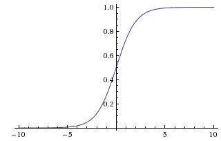

# 1.2逻辑回归

## 逻辑回归的定义

逻辑回归（Logistic Regression）也称为"对数几率回归"，又称为"逻辑斯谛"回归。是一个对数线性分类模型，虽然有*回归*两个字，但属于分类模型而不是回归模型。

### 逻辑回归模型为:

$$ P(Y=1|x) = \frac{e^{w\cdot x }}{1 + e^{w\cdot x}} $$

$$ P(Y=0|x) = \frac{1}{1 + e^{w\cdot x }} $$

$$ 其中 b = w_0,x_0 = 1 $$


## 逻辑回归的本质

**几率(odd):** 指事件发生的概率与该事件不发生的概率之间的比值。

事件的对数几率或logit函数为：

$$logit(p) = log \frac{p}{1-p}$$

对于逻辑回归:

 $$logit(P(Y=1|x)) = log \frac{P(Y=1|x)}{1-P(Y=1|x)} = w\cdot x​$$

所以逻辑回归模型的本质是：**输出Y=1的对数几率是输入x的线性函数表示的模型。** 逻辑回归是使用**线性预测的结果去逼近真实标记的对数几率**。这也是为什么被称为“对数几率回归”的原因。


## 逻辑回归的参数估计

逻辑回归相当于线性预测结果经过sigmoid激活函数(公式和曲线图如下)，得到类别概率分布。

$$sigmoid = \frac {1}{1+e^{-x}}$$



这里使用最大似然法进行参数估计，学习使得当前标记序列出现概率最大的权重向量$W$.


### 似然函数

设$$\phi()=sigmoid, z^{(i)}= w \cdot x^{(i)}$$

$$L(w) = P(y| x; w) = \prod_{i=1}^{n}((\phi (z^{(i)}))^{y^{(i)}}((1-\phi (z^{(i)}))^{1-y^{(i)}}),y \subseteq ({1,0})$$

则逻辑回归的**损失函数**为：

$$Loss(\phi(z), y) = - logL(w) = \sum_{i=1}^n(- y^{(i)}log(\phi(z^{(i)}))-(1-y^{(i)})log(1-\phi(z^{(i)})))$$

将最大化似然函数改为最小化对数似然即损失函数$Loss$.(*其实就是Cross_Entropy*)


### 参数学习

逻辑回归模型的参数学习通常采用的方法是梯度下降法和拟牛顿法

#### 梯度下降法

在开始梯度下降之前，要这里插一句，$ sigmoid function $有一个很好的性质就是

 $$ \phi' (z) = \phi(z)(1-\phi(z)) $$

下面会用到这个性质。

还有，我们要明确一点，梯度的负方向就是损失函数下降最快的方向。说明 一下，借助于泰勒展开，可以得到：
$$f(x+\delta) - f(x) \approx f'(x) · \delta$$

其中，$f'(x)$和$\delta$为向量，两者的内积为：

$$f'(x) · \delta = ||f'(x)|| · ||\delta|| · cos\theta $$

当$$\theta = 0$$即变化方向与梯度方向相同时，点积值(变化值)取最大值，表示梯度方向是局部上升最快的方向。

**也证明了梯度的负方向是局部下降最快的方向。**

那么通过梯度下降来更新权重：

$$w_j := w_j  -\eta \Delta\frac{dL(w)}{dw}$$

最后可以得到：

$$w_j := w_j + \eta \sum_{i=1}^n (y^{(i)}-\phi(z^{(i)}))x_j$$

**代码实现(Python):**

```python
import numpy as np
import matplotlib.pyplot as plt
import math

def loadDataSet():
    """
    加载数据集
    :return: 输入向量矩阵和输出向量
    """
    data = []
    label = []
    file = open('testSet.txt')
    line = file.readline()    # 直接读取的line是一个list,每个元素对应一个序号
    lines = file.readlines()
    for l in lines:
        lineArr = l.strip().split()
        data.append([1.0, float(lineArr[0]), float(lineArr[1])])
        label.append(int(lineArr[2]))

    data = np.stack(data)
    label = np.stack(label)
    return data, label

def sigmoid_classification(x):
    """
    sigmoid 函数实现,输出值大于0.5归于第一类，小于0.5归于第二类
    :param x: 输入值
    :return: 根据sigmoid返回值返回分类结果(0或者1)
    """
    re = 1/(1 + math.e**(-x))
    if re > 0.5:
        re = 1
    else:
        re = 0
    return re

def sigmoid(x):
    """
    梯度下降的分类器
    :param x: 输入向量
    :return: 根据sigmoid返回值返回分类结果(0或者1)nparray
    """
    res = []
    print(np.shape(x))
    for i in range(np.shape(x)[0]):
        re = 1/(1 + math.e**(-x[i]))
        if re > 0.5:
            re = 1
        else:
            re = 0
        res.append(re)
    return np.array(res)

# 梯度下降
def LR_GD(data, label, l_r):
    """
    使用逻辑回归模型进行训练
    :param data: 训练数据特征值集合
    :param label: 训练数据标签集合
    :return：训练之后得到的权重向量
    """
    # 权值向量定义
    n = np.shape(data)[1]
    w = np.ones(shape=(n))
    maxiter = 0
    flag = False
    while(not flag and maxiter < 1000):
        flag = True
        output = sigmoid(np.dot( data, w))
        if not np.array_equal(output, label):
            flag = False
            w += l_r * np.dot(data.transpose(),(label-output))
            print('updated_w: ', w)
        maxiter += 1
    return w

# 随机梯度下降，一次使用一个样本进行更新参数
def LR_SGD(data, label, l_r):
    """
    使用逻辑回归模型进行训练
    :param data: 训练数据特征值集合
    :param label: 训练数据标签集合
    :return：训练之后得到的权重向量
    """
    # 权值向量定义
    n = np.shape(data)[1]
    w = np.ones(shape=(n))
    maxiter = 0
    flag = False
    while(not flag and maxiter < 1000):
        flag = True
        for i in range(np.shape(data)[1]):
            output = sigmoid_classification(np.dot(w, data[i]))
            if output != label[i]:
                flag = False
                w += l_r * (label[i]-output)*data[i]
                print('updated_w: ', w)
            maxiter += 1
    return w

if __name__ == "__main__":
    data, label = loadDataSet()
    print(np.shape(data), np.shape(label))
    l_r = 0.1
    weights1 = LR_SGD(data, label, l_r)
    print(weights1)
    # weights2 = LR_GD(data, label, l_r)
    # print(weights2)
```


每次更新参数使用全部样本的梯度下降更新幅度更大，但可能会收敛不到全局最优点，在最优点两边跳动，而且如果样本数量太大消耗太大；每次更新参数使用一个样本的随机梯度下降更新的频率更快，收敛得也更快，也可以跳过局部最优点，可以用于在线学习，应用得更广泛；还有一种改进的随机梯度下降是每次随机选取更新参数用的样本。

#### 

## 逻辑回归的优缺点

### 优点：

1. 简单易于理解，直接看到各个特征的权重
2. 可用于在线学习(随机梯度下降)
3. 速度快，适合二分类问题

### 缺点：

1. 对数据和场景的适应能力有局限性，很难用线性逼近非线性分布。


## 逻辑回归 vs 线性回归

逻辑回归与线性回归(不包括感知机)的差别：

1. **激活函数**，逻辑回归使用了sigmoid激活函数，将输出值限制在了0-1之前相当于得到了属于某类的概率，而线性回归没有使用激活函数得到的是任何值;
2. **损失函数**，逻辑回归使用了最大似然函数来估计参数，其实得到的就是cross_entropy交叉熵，没有使用MSE(mean square error)，主要是因为cross_entroy 梯度下降的速度更快(逻辑回归，y的值只取0和1,不同于线性回归)。
3. **.参数更新**主要是标签值不同、更新的幅度不同。


