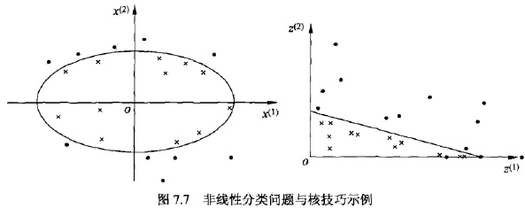

4.3核函数

## 前言

至此， 我们都是假设训练样本是线性可分的。 即, 存在一个划分超平面能将属于不同标记的训练样本分开. 但在很多任务中, 这样的划分超平面是不存在的.支持 **向量机通过核技巧 (kernel trick) 来解决样本不是线性可分的情况**。核技巧不仅应用于支持向量机，而且应用于其他统计学习方法。

##　核技巧

### 1. 非线性分类问题

非线性分类问题是指通过利用非线性模型才能很好地进行分类的问题。先看一个例子。

如左图，是一个分类问题，图中“•”表示正实例点，“x”表示负实例点。由图可见，无法用直线（线性模型）将正负实例正确分开，但可以用一条椭圆曲线（非线性模型）将它们正确分开。

> 非线性问题可以用一个超曲面来将正负实例正确分开。

非线性问题往往不好求解，所以希望能用解线性分类问题的方法解决这个问题。所采取的方法是进行一个非线性变换，将非线性问题变换为线性问题，通过解变换后的线性问题的方法求解原来的非线性问题。对图7.7所示的例子，通过变换，将左图中椭圆变换成右图中的直线，将非线性分类问题变换为线性分类问题。

设原空间为$$ X \sub R^2, x=(x^{(1)}, x^{(2)})^T \in X$$, 新空间为 $$Z \sub R^2, z=(z^{(1)}, z^{(2)})^T \in Z $$ 定义从源空间到新空间的变换(映射)：

$$z = \phi(x) = ((x^{(1)})^2, (x^{(2)})^2)^T$$

经过变换 $$z = \phi(x) $$,原空间$$X \sub R^2$$变换为新空间 $$ X \sub Z^2$$,原空间中的点相应地变换为新空间中的点，原空间中的椭圆

$$w_1(x^{(1)})^2 + w_2(x^{(2)})^2 + b = 0$$

变换成为新空间中的直线:

$$w_1(z^{(1)}) + w_2(z^{(2)} )+ b = 0$$

在变换后的新空间里，直线$$w_1(z^{(1)}) + w_2(z^{(2)} )+ b = 0$$可以将变换后的正负实例点正确分开。这样，原空间的非线性可分问题就变成了新空间的线性可分问题。

### 2. 核函数

### 核函数的定义

令 $$\phi(x) $$表⽰将 x 映射后的特征向量，于是，在特征空间中划分超平⾯ 所对应的模型可表⽰为： 

（4.16）

由4.1节有：

（4.17）

其对偶问题为：

（4.18） 

假设⼀个函数$$κ(x_i,x_j)$$ 表⽰ $$\phi(x_i)^T\phi(x_j) $$来计算内积，这个函数 $$κ$$ 我们称 为‘核函数’(kernel function)：
（4.19） 
重写公式(4.18):
（4.20） 
求解后：
（4.21） 

这等价于经过映射函数$$\phi$$将原来的输入空间变换到一个新的特征空间，将输入空间中的内积$$x_i · x_y$$变换为特征空间中的内积$$\phi(x_i)^T\phi(x_j) $$在新的特征空间里从训练样本中学习线性支持向量机。当映射函数是非线性函数时，学习到的含有核函数的支持向量机是非线性分类模型。

也就是说，在核函数$$k(x_i, x_j)$$给定的条件下，可以利用解线性分类问题的方法求解非线性分类问题的支持向量街。**学习是隐式地在特征空间进行的，不需要显示地定义特征空间和映射函数。这样的技巧称为核技巧**。它是巧妙地利用线性分类学习方法与核函数解决非线性问题的技术。在实际应用中，往往依赖领域知识直接选择核函数，核函数选择的有效性需要通过实验验证。

⼀般来说，只要⼀个对称函数所对应的核矩阵(Gram 矩阵)是半正定的，它就能作为核函数使⽤*(证明见《统计学习方法》P118)*.

### 核函数的选择

通过向高维空间映射及核技巧, 我们可以高效地解决样本非线性可分问题. 但面对一个现实任务, 我们很难知道应该具体向什么样的高维空间映射, 即应该选什 么样的核函数, 而核函数选择的适合与否直接决定整体 的性能. 表 6.1列出了几种常用的核函数. 通常, 当特征维数d超过样本数 m 时 (文本分类问题通常是这种情况), 使用线性核; 当特征维数d比较小. 样本数m中等时, 使用高斯核; 当特征维数d比较小. 样本数m特别大时, 支持向量机性能通常不如深度神经网络. 

 核函数还会满足三个性质：

- 若 $$κ_1,κ_2$$ 为核函数，那么对于任意正数 $$\gamma_1,\gamma_2$$，其线性组合也为核函数：$$\gamma_1K_1 = \gamma_2K_2$$
- 若 $$κ_1,κ_2$$ 为核函数，那核函数的直积也为核函数： $$K_1\bigotimes K_2(x, z) = K_1(x, z)K_2(x, z)$$
- 若 $$κ_1,κ_2$$ 为核函数，那对任意函数$$g(x)$$: $$k(x, z) = g(x)K_1(x, z)g(z)$$也是核函数。

> 问：为什么直接定义核函数，而不是先定义变换$$\phi(x)$$再得到核函数？
>
> 答： 核技巧的想法是，在学习与预测中之定义核函数 $$K(x, z)$$, 而不显式地定义映射函数$$\phi$$。通常，直接计算$$K(x, z)$$比较容易，而通过$$\phi(x)$$和$$\phi (z)$$计算$$K(x, z)$$并不容易。注意$$\phi$$是融入空间$$R^n$$到特征空间$$H$$的映射,到特征空间$$H$$一般是高维的，甚至是无穷维的。可以看到，对于给定的核$$K(x, z)$$，特征空间$$H$$和映射函数的取法并不唯一，可以取不同的特征空间，即便是在同一特征空间里也可以取不同的映射。
>
>