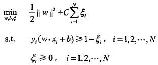
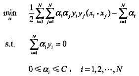
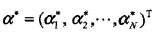
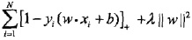
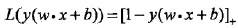

# 4.4软间隔

### 软间隔的定义

不管直接在原特征空间, 还是在映射的高维空间, 我们都假设样本是线性可分的. 虽然理论上我们总能找到一个高维映射使数据线性可分, 但在实际任务中, 寻找到这样一个合适的核函数通常很难. 此外, 由于数据 中通常有噪声存在, 一味追求数据线性可分可能会使模型陷入过拟合的泥沼. 因此, 我们放宽对样本的要求, 即允许有少量样本分类错误.

缓解该问题的一个办法是允许支持向量机在一些样本上出错。为此，要引入“软间隔(soft margin)” 的概念，如下图所示。

线性不可分意味着某些样本点$$(x_i, y_i)$$不能满足函数间隔大于等于1的约束条件$$s.t. y_i(w\cdot x_i + b) - 1 >= 0, i=1, 2, 1,2,···N$$.为了解决这个问题，可以对每个样本点$$(x_i, y_i)$$引进一个松弛变量$$\xi_i>=0 $$,使函数距离加上松弛变量大于等于1.这样约束条件变为：

$$y_i(w\cdot x+i + b) >= 1 - \xi_i$$

原来的代价函数变为：

$$\frac{1}{2}||w||^2 + C \sum_{i=1}^{N}\xi_i$$

里，C>0称为惩罚参数，一般由应用问题决定，C值大时对误分类的惩罚增大，C值小时对误分类的惩罚减小。最小化目标函数$$\frac{1}{2}||w||^2 + C \sum_{i=1}^{N}\xi_i$$包含两层含义:使$$\frac{1}{2}||w||^2 $$尽量小即间隔尽量大，同时使误分类点的个数尽量小，C是调和二者的系数。

有了上面的思路，可以和训练数据集线性可分时一样来考虑训练数据集线性不可分时的线性支持向量机学习问题。相应于硬间隔最大化，它称为软间隔最大化。线性不可分的线性支持向量机的学习问题变成如下凸二次规划（convex quadratic programming)问题（原始问题）：

（4.22）

上述原始问题是一个凸二次规划问题，因而关于$$(w, b, \xi)$$的解是存在的。可以证明w的解是唯一的，但b的解不唯一，b的解存在于一个区间。

上节讲到的是线性可分支持向量机，也属于线性支持向量机，是硬间隔最大问题。

### 支持向量

在线性可分的情况下，将对偶问题的解中对应于$$\alpha_i^*>0$$的样本点的实例$$x_i$$称为支持向量(软间隔的支持向量),如下图

这时的支持向量要比线性可分时的情况复杂一些。图中，分离超平面由实线表示，间隔边界由虚线表示，正例点由“。”表示，负例点由“X”表示。图中还标出了实例$$x_i$$到间隔边界的距离$$\xi_i/||w||$$。

### 合页损失函数

对于线性支持向量机来说，其模型为分离超平面 $$w^*\cdot x_i +b = 0$$及决策函数$$f(x) = sign(w^*\cdot x + b^*)$$，其学习策略为软间隔最大化，学习算法为凸二次规划。线性支持向量机学习还有另一种解释，就是最小化以下目标函数：
(4.23)

目标函数的第1项是经验损失或经验风险，函数 

(4.24)

称为合页损失函数（hinge loss function)。下标“+”表示以下取正值的函数。

(4.25)

像一本打开的书，从后往前看的边缘形状。故称为 合页函数。

这就是说，当样本点$$(x_i, y_i)$$被正确分类且函数间隔（确信度）大于1时，损失是0,否则损失是$$1-y_i(w\cdot x_i + b)$$。现在回过头来看这张图

注意到在图中的实例点x4被正确分类，但损失不是0。目标函数的第2项是系数为$$\lambda$$的w的L2范数，是正则化项。 

所以有：

