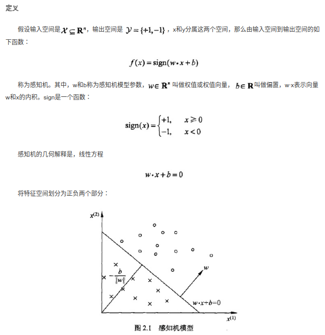
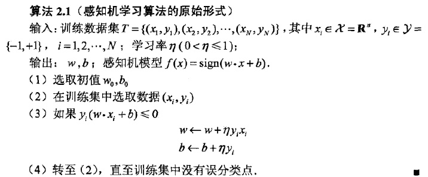
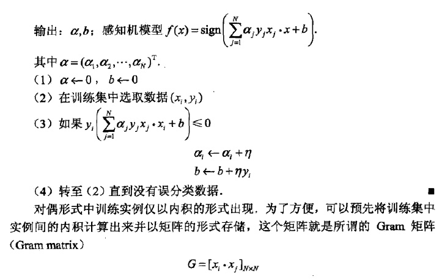

# 1.1 感知机

## 概念与定义

感知机(Perceptron)是最基础的线性二分类模型，输入实例的特征向量，输出实例的$$\pm$$类别

主要目标是**学习一个将训练集中的正实例点和负实例点完全正确分开的分离超平面**.



*感知机并不只是二维的，w x可以是多维的权重向量和特征向量，一般都有多个特征，所求的也是多维的超平面。*


## 学习策略

将**误分类点到分离超平面的距离作为损失函数**.没有选择误分类点的数量作为损失函数，因为不好求梯度更新参数。                                                                 

输入空间$$R^{n}$$中任一点$$x_0$$到超平面S的距离:

$$ \frac{w*x_0 + b}{||w||} $$

$$ 这里||w||是w的L_2范数 $$

对于误分类的点,$$ y(w*x+b) < 0 $$

则 损失函数 $$ L(w, b)= - \sum_{x_i\subseteq M}{y_i(w*x_i + b)} $$


## 学习算法

感知机学习算法就是对以下最优化问题的算法

$$min_{w,b} L(w,b ) =- \sum_{x_i\subseteq M}{y_i(w*x_i + b)} $$

感知机学习算法是误分类驱动的，先*随机选择*一个超平面,然后使用**梯度下降法**不断极小化损失函数.*所谓梯度下降法就是使用损失函数的梯度不断更新参数w b求得对应的损失函数的极小值*。损失函数的梯度为：

$${\nabla}_{w}L(w,b) = -\sum_{x_i \subseteq M}y_ix_i$$

$$\nabla_wL(w, b) = -\sum_{x_i\subseteq M}y_i$$

所谓梯度，就是每个变量的偏导数的集合，是一个向量，指的是标量场增长最快的方向，长度是最大变化率。所谓标量场，指的是空间中任意一个点的属性都可以用一个标量表示的场。

选择一个误分类的点，对参数w b进行更新

$$w \leftarrow w + \eta y_ix_i$$          

$$b  \leftarrow b + \eta y_i$$




## 算法实现(Python)

```python
def train(x, y, lr):
    w = np.asarray([0, 0, 1])
    global  history
    while (1):
        flag = True # 用来判断是否训练完成
        for i in range(len(x)):
            pred_y = np.dot(w, x[i])
            if (pred_y * y[i]) <= 0:   #更新参数
                w += lr * x[i] * y[i]
                print('w modified ', w)
                flag = False
        if flag:
            break
```

**算法效果可视化：**


## 算法的收敛性


## 感知机学习算法的对偶形式

所谓对偶，我的理解是转变思路，以另一种方式解决同一问题，但结果并不会发生改变。

对偶形式的基本想法是，**将w和b表示为实例$$x_i$$和标记$$y_i$$的线性组合的形式，通过求解其系数而求得w和b.**

$$w = w + \eta x_iy_i  \rightarrow w = \sum_{i=1}^{N}a_iy_ix_i$$

$$b = b + \eta y_i  \rightarrow   b = \sum_{i=1}^N a_i y_i$$

其中$$a_i=n_i\eta$$ ,$$n_i$$表示当前实例更新的次数，**实例点更新的次数越多，代表它离超平面越近，越难正确分类。**



## 总结

感知机算法学习参数(权重向量和偏置)求得将正负实例分开的分离超平面。损失函数利用的是误分类点到分离超平面的函数距离$$y_i(w\cdot x_i + b)​$$的总和，参数更新利用的是梯度下降。之所以是最基础是因为不管损失函数还是参数更新的方法都很是最简单的而且也没有对分离超平面进行限制取最优。感知机算法的对偶形式是将权重向量表示为实例ｘ和标记y的组合，使用了更多的矩阵运算，在使用相同的初始参数的情况下会得到相同的结果。